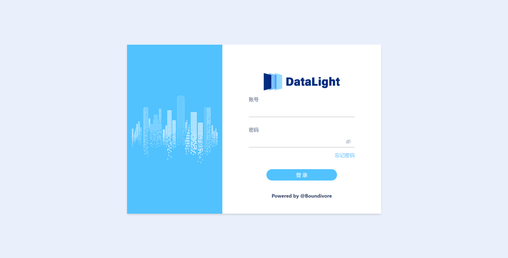
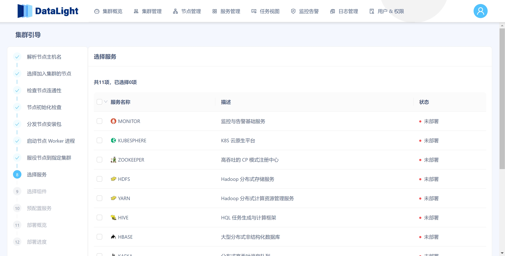
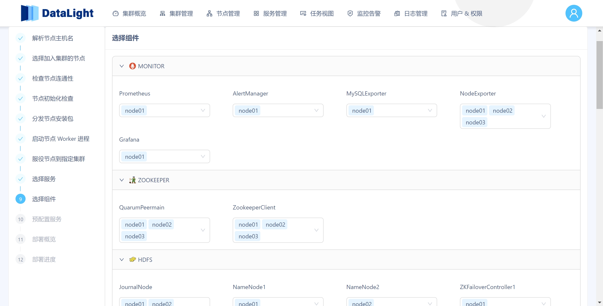
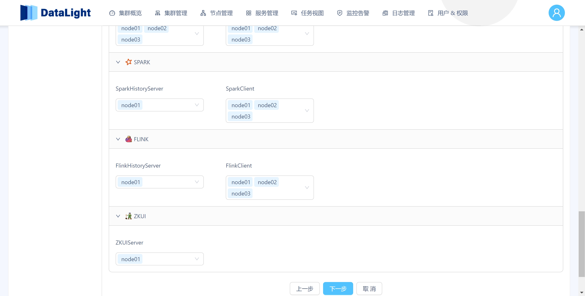
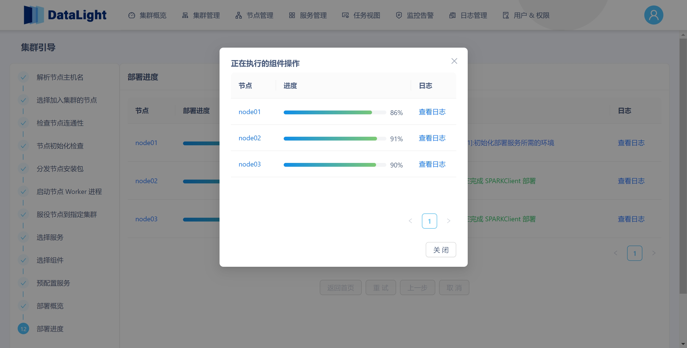
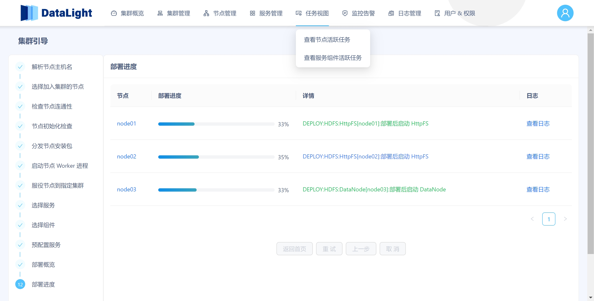
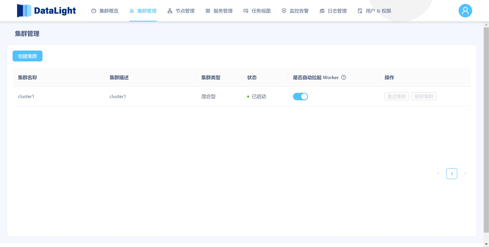
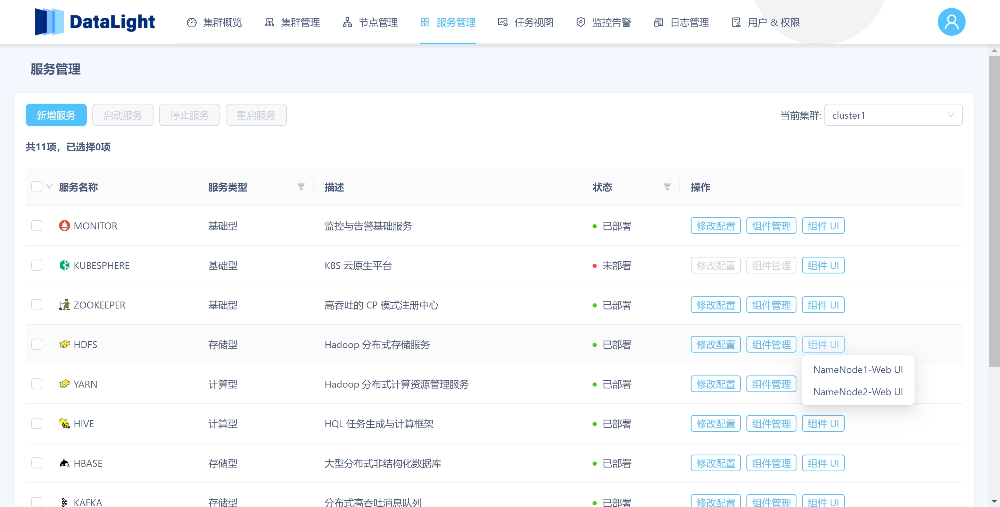
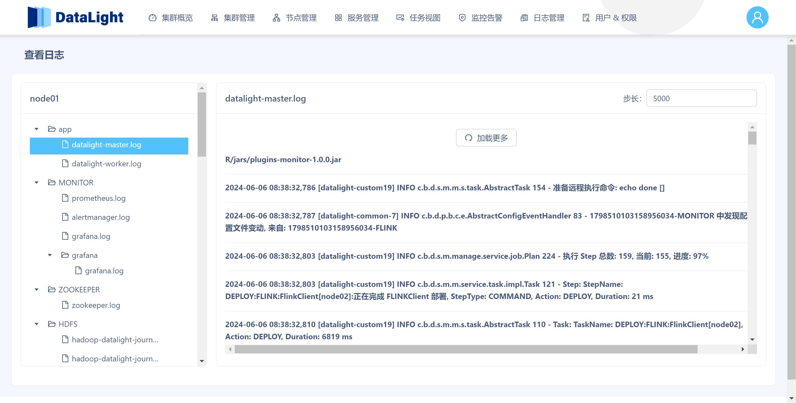

# Boundivore-DataLight 产品手册

## 一、简介

DataLight 是一个开源的大数据运维管理平台，用于简化和自动化大数据服务的部署、管理和监控。它提供了一套全面的工具来管理您的大数据生态系统，旨在帮助企业实现简洁、快速地构建 OLAP 与 OLTP 统一的业务平台。用户可以通过 plugin 插件，以插拔式的方式快速集成自己的业务服务或其他大数据组件，从而在平台中进行统一管理。

资源汇总如下：

* [项目官网](http://datalight.boundivore.cn) 
* [后端仓库](https://gitee.com/boundivore/boundivore-datalight) 
* [前端仓库](https://gitee.com/boundivore/boundivore-datalight-web) 
* [资源包下载地址](https://pan.baidu.com/s/1342bIcEBDQHdFA35KUTjbQ) `网盘提取码: data`
* [产品手册](./.documents/docs/产品手册.md)
* [开发手册](./.documents/docs/开发手册.md)

## 二、产品操作

在开始前，如尚未进行节点与 Master 初始化操作，请前往查阅 [部署手册](../../README.md) 。

如果需要对产品进行订制，请前往查阅 [开发手册](./开发手册.md) 。

### 2.1 登录

通过 DataLight 提供的登录界面，输入用户名和密码进行身份验证，成功后即可访问平台的管理功能。

默认初始账号密码为：

~~~text
账号：admin
密码：admin
~~~

### 2.2 初始化密码

首次登录时，系统会要求用户初始化密码。根据提示设置符合安全要求的密码，以确保账户安全。

### 2.3 部署前首页

登录成功后，用户会进入部署前的首页，平台会显示部署集群的操作入口。

### 2.4 创建集群

在创建集群时，用户需要定义集群的名称和配置，确保集群能够满足业务需求。其中表单中显示了当前 DLC（服务组件拓展包）的版本，以及该服务包中的服务组件类型以及对应版本。

其中集群类型中，目前支持两种集群类型，分别为：

* 混合型：允许部署所有大数据服务。
* 计算型：仅允许部署类别为“COMPUTE”类型的大数据服务，其中存储服务将复用“混合型”集群中的存储服务。即，存储计算分离架构。注意，计算型集群依赖混合型集群，无”混合型”集群时，无法创建“计算型”集群。

创建成功后，如下图所示。

### 2.5 新增节点

新增节点是指在现有集群中添加新节点的操作，如下图所示，在“集群节点”栏目中输入节点名称，可以多行输入。格式举例：

~~~text
node[1-3]
node[01-04]
[1-4]node
node[a-c]
linux[1-3].com
node109
linux103.com
datalight202.com
~~~

#### 2.5.1 解析节点主机名

系统会自动解析新增节点的主机名，最终以节点列表的形式呈现，以便在集群中进行识别和管理。

选择想要添加的节点，单击“下一步”

#### 2.5.2 探测节点连通性与节点资源

此时，系统会自动检测新增节点的网络连通性和硬件资源，以确保节点能够正常工作。

#### 2.5.3 检查系统环境

系统会检查新增节点的操作系统和相关环境，以确保满足 DataLight 的运行要求。

#### 2.5.4 分发部署包

系统会将必要的部署包分发到新增节点上，以便进行后续安装和配置。该过程中会显示出每个节点推送包的进度信息，包括：

* 整体传输进度
* 当前传输速率
* 当前传输的文件名

其中，Master 所在节点，将忽略网络传输，进度直接为 100%。

传输完成后如下图所示。

#### 2.5.5 查看作业日志

用户可以初始化或部署过程中，查看作业日志，以了解部署进度和排查问题。

#### 2.5.6 启动 Worker

部署完成后，系统会启动节点上的 Worker 服务，以便加入集群进行工作。

下图为正在自动启动 Worker 节点的页面状态。

Worker 启动成功后，可以选择指定节点，并将指定节点服役到集群。

#### 2.5.7 服役节点

节点启动后，系统会将其标记为服役状态，使其正式加入集群并开始提供服务。

### 2.6 部署服务

节点初始化完成后，用户可以通过部署服务按钮，进行服务部署，系统会自动进行安装和配置。

选择想要部署的服务，页面如下图所示。

选择服务后，在稍后开始执行部署时，平台会根据配置文件中(./datalight/conf/service)中配置的顺序与优先级进行展示和部署，并根据配置文件中指定的依赖关系与互斥关系进行部署前检查。

### 2.7 部署组件

基于上一步已选择部署的服务，选择组件页面会呈现每个被选择服务下的组件列表信息，用户可以在该页面指定哪些组件部署在哪些节点上，该过程同样会检查组件之间的依赖关系。例如：

* NameNode1 与 NameNode2 不能部署在同一个节点；

* NameNode1 与 ZKFailoverController1 必须在等一个节点；

  等等类似的检查会在此处进行。

选择的组件分布，如下两图所示。

此时，单击“下一步”进行“预设服务配置”。

### 2.8 预设服务配置

服务组件在部署时，会根据插件包设置的参数对其进行部署，部署后，用户可以通过配置文件管理功能，重新修改这些配置。然而，有些情况可能需要用户在部署服务组件之前，先预设配置服务参数，系统会根据这些配置进行部署，如果没有设置，则将会使用默认参数进行部署，这在部分服务中，有可能导致部署失败，请详细检查。

### 2.9 部署概览

完成“预设服务配置”后，系统会提供一个部署概览页面，展示所有服务组件的分布情况。

此处可以展开某个服务，查看该服务下组件在各个节点中的分布情况。

### 2.10 执行部署

单击“开始部署”按钮，即可开始服务部署工作。

#### 2.10.1 生成部署计划

开始部署时，系统首先会根据用户选择的服务和组件自动生成详细的部署计划，后续 Master 将按照该计划执行部署。

#### 2.10.2 部署执行中

在部署执行过程中，系统会自动完成各项安装和配置任务。其中“蓝色”为正在执行的任务，“绿色”为当前描述的内容已经执行完成。

此处同样可以查看部署日志。

如果在部署过程中发生失败，可以排查相关问题后，通过下方的“重试”按钮进行重试部署。也可以返回上一步，重新编辑服务、组件的部署。

#### 2.10.3 状态恢复

如果部署过程中如果跳出了当前的部署页面，可以在“集群管理”页面中，单击“继续集群引导”恢复。

此时，单击“继续集群引导”时，将会回到如下正在部署服务组件的页面。

### 2.11 集群概览

部署完成后，会回到平台首页，默认展示第一个标签，展示集群的整体状态和各节点的运行情况。

### 2.12 集群管理

用户可以通过集群管理页面对集群进行各种操作，包括整个集群节点的重启操作，删除集群等。

此处有几点内容需要注意：

* 重启集群：该操作会涉及到重启集群所有节点，包括 Master 节点，这将导致整个集群服务不可用，系统重启恢复后，需要手动启动 Master 进程。如需系统启动自动恢复 Master 进程，请将 Master 进程添加到 systemctl 中。
* 删除集群：删除集群需要满足前置条件，即：集群中已没有活跃的服务、组件、节点。

### 2.13 节点管理

用户可以在节点管理页面查看和管理集群中的所有已服役的节点，包括重启节点，删除节点等。删除节点需要满足前置条件，即：指定节点中已经没有可用的服务与组件。

同样，可以通过“新增节点”按钮，向当前集群新增服役节点。该过程与之前初始化的过程一致。

### 2.14 服务管理

服务管理页面允许用户管理集群中的各类服务，包括：

* 启停服务：对选中服务进行批量启停操作，该过程会涵盖该服务下分布在所有节点上的所有组件；
* 修改配置文件：对服务配置文件进行修改；
* 访问组件 UI：便于用户方便跳转到服务组件官方自带的 UI 页面；

当对服务进行启停操作时，同样可以观察到服务状态的变化，以及作业执行进度的变化。

在上方“任务视图”标签中，可以查看当前作业的执行进度和日志信息，如下图所示。

### 2.15 配置文件管理

配置文件管理页面提供对系统各类配置文件的管理功能，用户可以查看、编辑和更新配置文件。

在更新配置文件时，平台会自动将相同的配置文件归为同一组，该过程是动态的，无需用户预先设置分组情况。同时，如果用户需要将部分节点的配置文件与其他节点的配置文件内容区分开，即，不同节点采用不同的配置内容，可以手动按照节点对配置文件进行分组，如下图所示。（后续平台还将支持 Linux 文件反向同步、手动新增配置文件等功能）

### 2.16 组件管理

组件管理页面允许用户管理集群中的各种大数据组件，包括新增组件、启停组件，删除组件等。其中，新增组件与初始化部署服务的过程类似，不再赘述。删除组件需要满足前置条件，即该组件处于“停止”状态，才允许对其进行删除操作。

### 2.17 服务监控

服务监控页面实时展示集群中各服务的运行状态和性能指标，该部分数据与 Prometheus 中的监控数据同步，帮助用户及时发现和解决问题。

注意：该页面监控指标尚未全部完善，用户可通过 Grafana UI 查看更详细的、完善的监控信息。

### 2.18 告警管理

告警管理页面用于编辑告警规则，查看告警信息等，如下图展示了新增告警规则的过程。

该告警规则新增后，会产生一个标准的 AlertManager Rules 配置文件，用户可以在此处书写如何符合 Prometheus 规则的告警表达式，以及自定义的告警 KV，这些 KV 内容也将在告警时，通过配置的邮件与接口传递。

新增配置好的告警规则，将会同步出现在 Prometheus Alerts 列表中，同时，该列表中，除了显示用户自定义的告警规则外，还会显示平台系统自身携带的一些告警规则。

注：平台系统自身集成的告警规则，可以实现服务、组件的自动拉起，确保服务、组件长期稳定运行。

### 2.19 日志管理

日志管理页面提供对各个节点中的系统日志、服务组件日志查阅功能，帮助用户进行故障排查和性能优化。

例如在下图中，想要查看其中某个节点的日志信息，可单击“查看日志”。

然后在左侧的列表中，选择想要查看的日志文件，并在右侧进行动态的分步加载即可（下拉到末尾会自动加载更多日志）。

注：后续平台还将实现更多更人性化的操作，例如：反向查找，上滑下拉双向动态加载，指定位置加载等。

### 2.20 用户管理

用户管理页面允许管理员添加、删除和管理平台用户，并分配不同的权限和角色。

新增用户界面如下：

用户详情页面如下：

### 2.21 角色与权限管理

角色与权限管理页面提供对用户角色和权限的配置功能，确保不同用户具有适当的访问权限（接口业务权限管理）。

注：平台后续还将支持更详细的权限管理，包括页面权限管理与数据权限管理等。

新增角色如下图所示，可以在创建新角色的同时，为该角色绑定指定的权限。

或者为已经存在的角色，分配或移除权限类目，如下图所示。

### 2.22 修改密码

用户可以在修改密码页面更新自己的登录密码，以确保账户安全。

### 2.23 退出登录

用户可以通过退出登录页面安全地退出系统，结束当前会话。

### 2.24 监控详情

DataLight 提供了详细、全量的监控数据，且实现了大量自定义监控报表（Grafana Dashboard），无论是直接使用，还是将其借鉴复用到自己的项目中，都非常方便。

注：Grafana 账号密码请在文末查阅。

对于更详细的监控指标，用户可以通过 MONITOR 服务条目中的 “组件 UI” 按钮，前往 Grafana 页面进行查看，如下图所示：

在 Grafana 的 Dashboard 列表中，会按照 [服务名称]-[组件名称] 对 Dashboard 进行分类，方便用户快速定位查找。

部分 Dashboard 举例，如下方若干图片所示。

## 三、三方账号与密码

该部分内容会持续更新。

对于集成的第三方服务组件的默认账号与密码，会在此处进行备注。

~~~shell
# MONITOR-Grafana
主账号：admin
主密码：adminadmin
注意：该账号密码不可修改，修改后，程序将无法自动初始化 Dashboard。

子账号：admin-<集群名称>
子密码：admin-<集群名称>

子账号：editor-<集群名称>
子密码：editor-<集群名称>

# ZKUI
账号：admin
密码：admin

# KUBESPHERE-Harbor
账号：admin
密码：Harbor12345

# KUBESPHERE-K8S
账号：admin
密码：kubectl -n kubesphere-system get secret ks-installer -o yaml
~~~

## 参与开源

如果您对本项目感兴趣，欢迎提供积极的反馈，帮助该项目做的更好。

微信公众号：

QQ 交流群：

微信交流：

## 开源协议

本项目采用 Apache 2.0 开源协议。有关详细内容，请查看 [Apache 2.0 LICENSE](http://www.apache.org/licenses/)。

