# 服务集成指南

DataLight 允许用户集成任意自己想集成的常驻或非常驻进程（作为 DataLight 中的服务组件），当你有一个现成的可部署的服务需要集成时，只需要简单的配置和插拔式的服务声明，即可快速增量部署新的服务。

下面，我们来看看具体怎么完成这个流程。

## 一、打包自定义服务

自定义服务分为两种大的类型：

* 自己开发的进程
* 第三方的进程

对于自己开发的进程，用户直接按照指定的格式打包即可，具体的打包格式强烈建议为这种格式：
~~~shell
dlc-[服务名称]-[版本号].tar.gz
~~~

且解压后为单个文件夹，且一服务名全大写命名。

例如：

~~~shell
dlc-hive-3.1.3.tar.gz，解压后：HIVE/
dlc-flink-1.19.0.tar.gz，解压后：FLINK/
~~~

具体相关打包流程和说明可以参考 DataLight 开源项目中的 docs/package/ 目录下的打包文档。

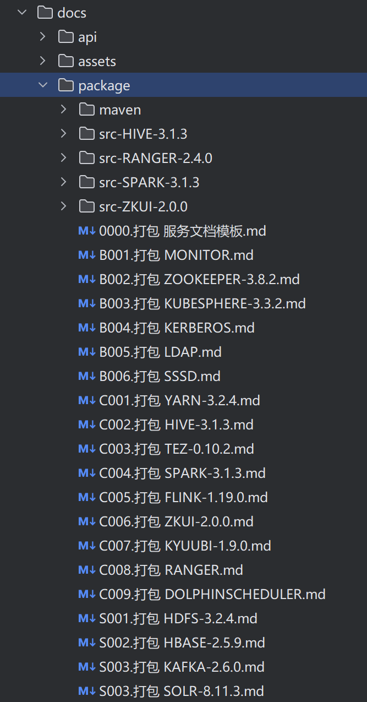

对于第三方的进程，如果官网编译好的二进制包能够满足需要，则直接解压后，按照目录规则的要求进行整理后，重新打压缩包即可。

如果官网的二进制包无法满足需要，则需要对该服务重新编译，适配相关版本后，再进行打包。

## 二、创建服务插件目录

对于新增的自定义服务，首先需要在源码工程中的 **.documents/plugins/** 目录下新增以该服务命名的文件夹（全大写且唯一），然后再其中创建对应的目录结构，以 HDFS 为例，如下图。

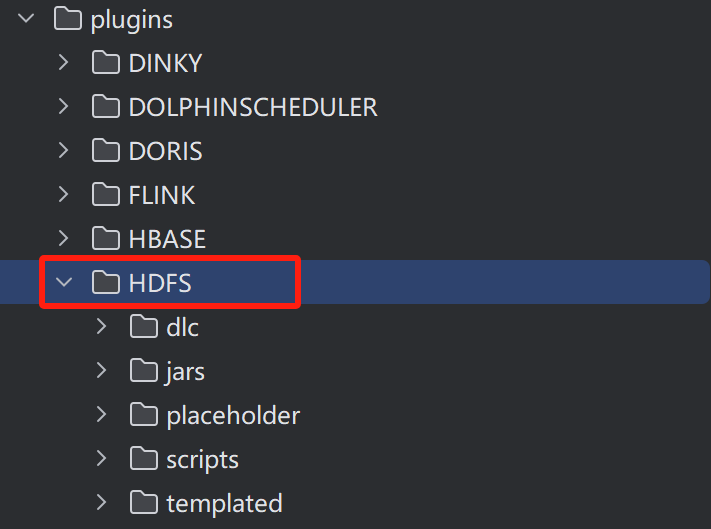

### 2.1 准备服务配置文件模板——templated

该目录用于存放所有该服务的配置文件，一般建议存放的目录结构遵循原服务的目录结构。

例如，HDFS（Hadoop）服务中，原本的目录结构包含：bin/、sbin/、etc/hadoop/ 等，那么 templated 下的目录结构也应该保持这种结构。并且目录中的所有配置文件，也建议直接从原服务中复制过来。

这样做之后，后续只需稍加配置，DataLight 就可以将这些配置文件全部扫描入库，并在未来可以通过图形化页面的方式进行修改，并分布式写入到各个节点上。

还是以 HDFS 为例：

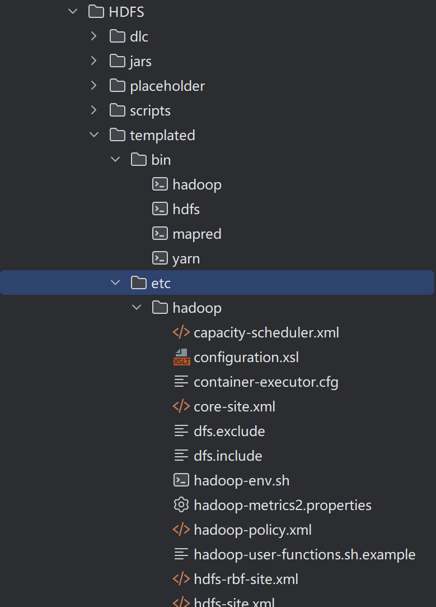

**Tips：**如果某些配置文件，明确知道永远不会被修改，则不需要拷贝至 templated 目录下，这样可以减少目录列表中的配置文件，提升阅读效率。 同时，如果你还要自己增加的配置文件，也可以自己创建新的目录或在原有的目录中增加额外的配置文件，这在 DataLight 中都是允许的，且非常简单。

此时，你一定知道在部署该服务时，需要修改哪些配置文件的哪些属性，那么，此时你就需要将这些配置文件下的属性，用占位符的方式进行替换。以 HDFS 为例，在部署时需要修改 core-site.xml 配置文件，其中涉及到若干需要修改的属性，例如这样：

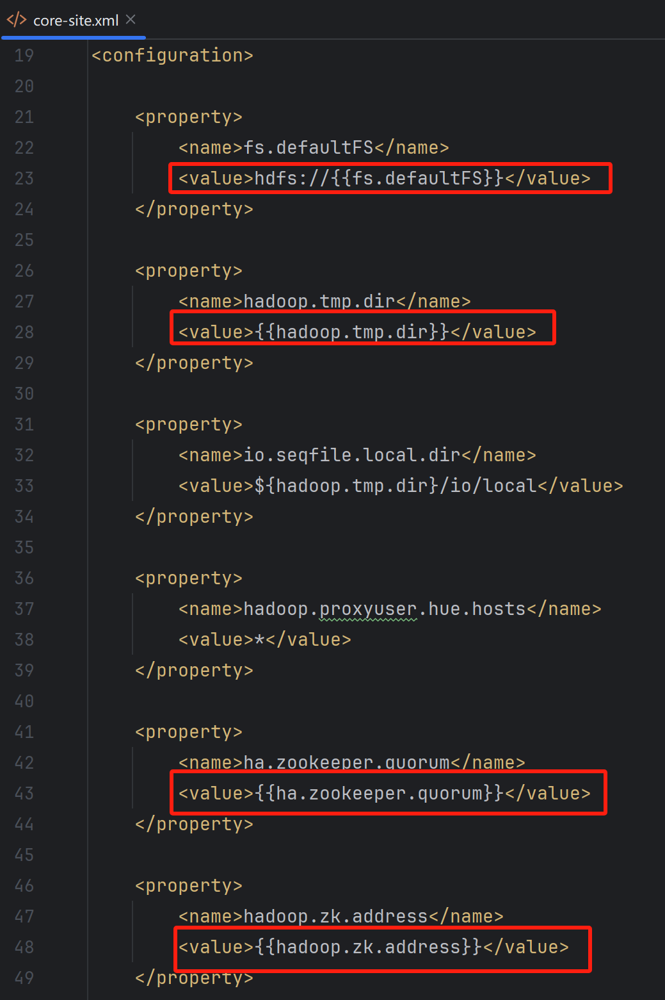

以{{}}双花括号占位符的方式，进行标注，随后会在 plugins 插件加载时，替换为具体的值，并分发到各个节点。

### 2.2 准备服务操作脚本——scripts

该目录下用于存放操作服务时所需的功能性脚本文件，例如，在部署时，需要执行的具体操作，或者服务的启停管理等。以 HDFS 为例：

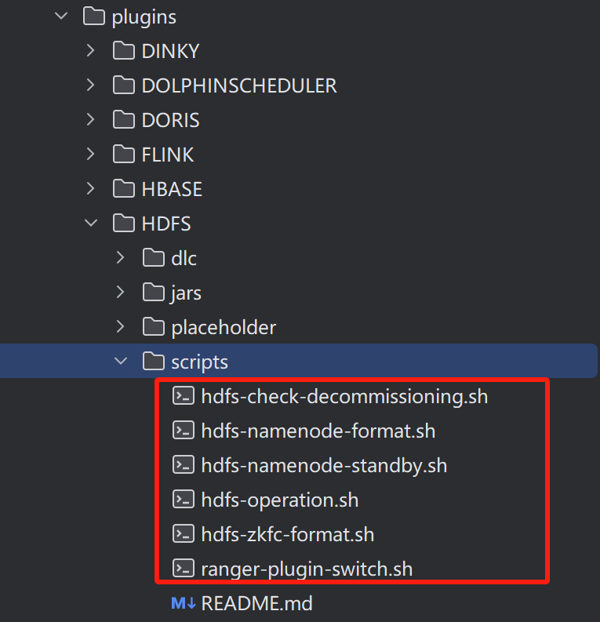

用户在集成自己新增的服务时，可以参考这些脚本的编写方法，比葫芦画瓢的进行创建和修改，以便完成指定的功能。

这些脚本会在后续配置文件中被引用。

### 2.3 准备服务预配置模板——placeholder

DataLight 在进行服务部署时，会自动修改配置文件为指定的参数值（在插件中配置的，相对固定的初始化参数）。但有些时候，用户需要在部署之前，动态地指定参数值。例如：指定 HDFS 的数据存放目录（不同用户，不同情况下的部署，可能会指定不同的数据存放目录，所以这个数据存放目录的参数，不能隐式的指定为固定的目录。即使后续允许做数据迁移，但如若此做，体验将很差，俗称脱裤放屁。因此我们尽量不要脱裤放屁，而是让用户能够在部署前，指定自己必要的参数）。

**Tips：**并非所有的服务在部署前都需要用户指定自己的参数。另外还有一些必须在部署前由用户指定的参数，比如 HIVE 部署时，需要指定 MetaStore 的 MySQL 连接信息等。

其中该目录下的文件，要遵循固定的格式：

~~~shell
[服务名]-PLACEHOLDER.yaml
~~~

例如：

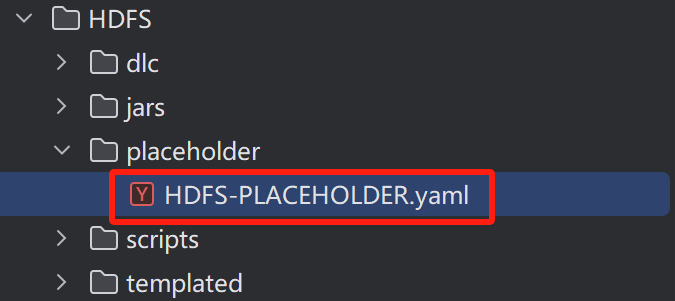

并且，该文件中的内容，要遵循如下结构，以 HDFS 为例（具体作用以注释说明）：
~~~yaml
datalight:
  service:
    name: HDFS
    # 该属为一个数组，如果涉及到多个配置文件中的属性需要在部署前由用户指定参数值，则配置多个templated-file-path
    placeholder-infos:
      - templated-file-path: '{{DATALIGHT_DIR}}/plugins/HDFS/templated/etc/hadoop/hdfs-site.xml'
      	# 该属性为一个数组，如果同一个配置文件中，存在多个属性需要在部署前由用户指定参数值，则配置多个 placeholder、decribe、default
        properties:
			# 具体的占位符标记，与{{DATALIGHT_DIR}}/plugins/HDFS/templated/etc/hadoop/hdfs-site.xml中的具体占位符标记一致，该属性将会在部署前预配置页面中提示用户设置，如无设置，则将使用默认值。
          - placeholder: '{{dfs.datanode.data.dir}}'
            # 属性描述
            describe: 'DataNode 中数据的存储目录'
            # 该属性默认值
            default: '/data/datalight/data/HDFS'
~~~

### 2.4 准备服务监控端口号——PortConstants.java

所有可部署服务监控数据将由指定端口号上报至 Prometheus，因此，每个服务都会有独立的，无冲突的端口号最为监控数据上报端口包，主要分为几种类型：

* 基于第三方 JMX Agent 的 JVM 监控
* 基于服务自身携带的监控
* 自己开发的三方常驻或定时任务类型的监控

无论是哪种类型，数据上报到 Prometheus 都需要提供一个采集监控数据的端口号，因此，该 PortConstants 类提供了所有服务监控端口号的声明，因为这些端口号一般无变化，且不建议变化，因此没有抽出到配置文件中进行编写，后续将会考虑抽取出来，以加载配置文件的方式声明这些端口号。

用户在开发或集成新服务时，切记将该服务下所有常驻进程的监控数据采集的端口号进行声明和备注，否则在下面的 plugins 中，无法方便的获取这些端口号并告知 Prometheus，从而无法在 Prometheus 中采集到这些监控数据。

服务组件的监控端口号以 Map 结构保存在内存中，其中 Key 的格式是 [服务名]-[组件名]，Value 为端口号，例如：

~~~Java
put("ZOOKEEPER-QuarumPeermain", "19001");

put("HDFS-JournalNode", "19002");
put("HDFS-NameNode", "19003");
put("HDFS-ZKFailoverController", "19004");
put("HDFS-DataNode", "19005");
put("HDFS-HttpFS", "19006");
~~~

具体可参见代码。

### 2.5 准备配置文件修改插件

以上内容准备就绪后，需要在项目工程的 datalight-plugins 模块下，创建子模块，命名规则为：plugins-<服务名称>，全小写，例如：

~~~shell
plugins-hdfs
~~~

#### 1.  新建 plugins 服务插件模块

假设我们现在想要创建 elasticsearch 的部署插件。

* 创建方式

  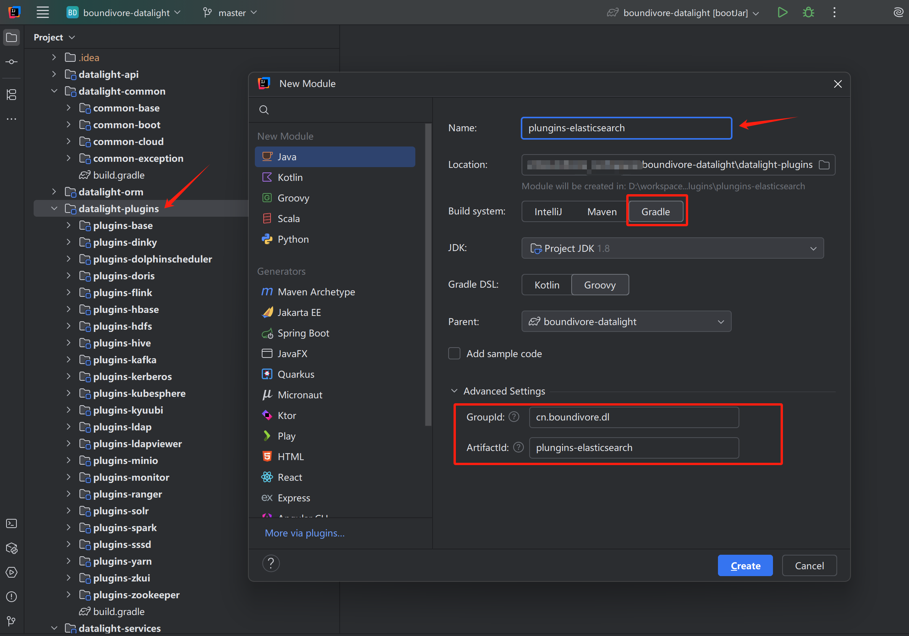

* 修改 build.gradle 配置

  将 Gradle 配置修改为如下内容，它将自动引用那些基础的父模块中的内容，随后等待数秒，等待项目创建完毕。

  ~~~groovy
  plugins {
      id 'java'
  }
  
  group 'cn.boundivore.dl'
  version '1.0.0'
  
  repositories {
      mavenCentral()
  }
  
  dependencies {
      implementation project(":datalight-plugins:plugins-base")
      implementation project(":datalight-common:common-base")
  
      implementation group: 'cn.hutool', name: 'hutool-all'
      implementation group: 'com.fasterxml.jackson.core', name: 'jackson-core'
      implementation group: 'com.fasterxml.jackson.core', name: 'jackson-annotations'
      implementation group: 'com.alibaba', name: 'fastjson'
      implementation group: 'com.thoughtworks.xstream', name: 'xstream'
      implementation group: 'org.apache.logging.log4j', name: 'log4j-to-slf4j'
      implementation group: 'org.apache.logging.log4j', name: 'log4j-api'
      implementation group: 'com.nimbusds', name: 'nimbus-jose-jwt'
  
      implementation  group: 'com.alibaba', name: 'transmittable-thread-local'
  }
  
  test {
      useJUnitPlatform()
  }
  ~~~

#### 2.  逐个建立配置文件的对应的配置类

在创建服务插件时，我们务必已经知道了哪些配置文件需要修改（见 **2.1 小节**），此时，只需要根据待修改的配置文件名，建立对应的 Java 类即可，每个待修改的配置文件，对应一个操作它的 Java 类。

以 HDFS 的 plugins 为例，例如这样：

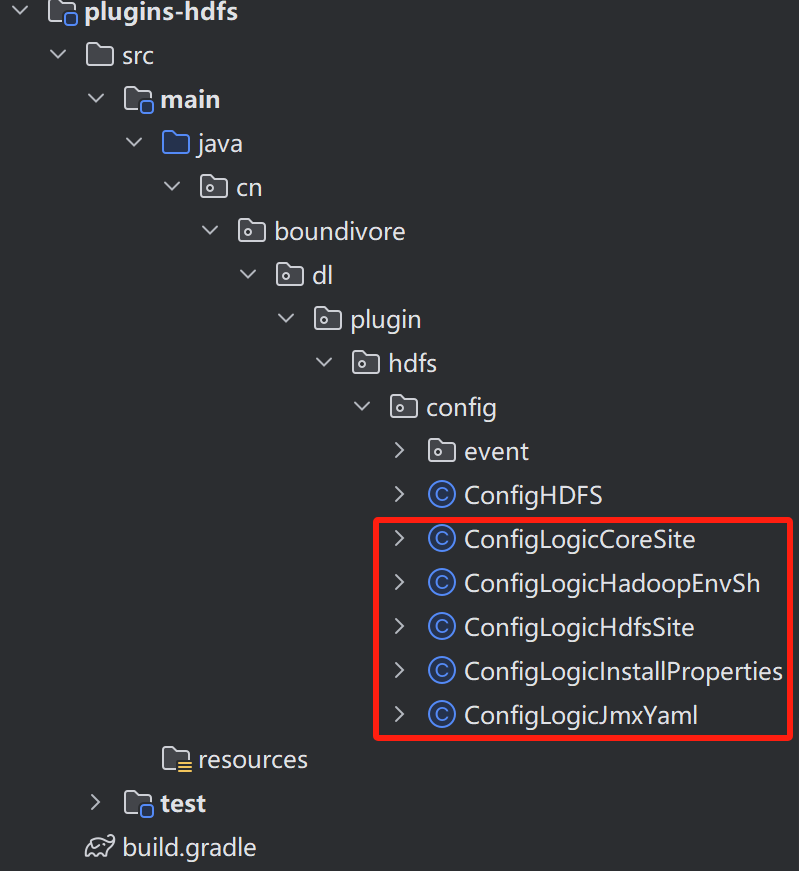

**Tips：**一般情况下，一个服务下需要修改的配置文件并不会太多，且目前 DataLight 已经是按照服务来区分 plugins 模块了，所以不必担心太多 Java 类难以管理。

随后，在每个配置文件具体修改逻辑的 Java 类中，可以看到相关逻辑，用户在集成新的服务时，可以参考之前其他服务已经写好的类，这样可以快速知道如何替换这些属性。以 HDFS 的 core-site.xml 配置文件为例：

~~~java
/**
 * Copyright (C) <2023> <Boundivore> <boundivore@foxmail.com>
 * 

 * This program is free software; you can redistribute it and/or
 * modify it under the terms of the Apache License, Version 2.0
 * as published by the Apache Software Foundation.
 * 

 * This program is distributed in the hope that it will be useful,
 * but WITHOUT ANY WARRANTY; without even the implied warranty of
 * MERCHANTABILITY or FITNESS FOR A PARTICULAR PURPOSE.  See the
 * Apache License, Version 2.0 for more details.
 * 

 * You should have received a copy of the Apache License, Version 2.0
 * along with this program; if not, you can obtain a copy at
 * http://www.apache.org/licenses/LICENSE-2.0.
 */
package cn.boundivore.dl.plugin.hdfs.config;

import cn.boundivore.dl.plugin.base.bean.PluginConfig;
import cn.boundivore.dl.plugin.base.config.AbstractConfigLogic;
import cn.hutool.core.lang.Assert;

import java.io.File;
import java.util.Comparator;

/**
 * Description: 配置 core-site.xml 文件
 * Created by: Boundivore
 * E-mail: boundivore@foxmail.com
 * Creation time: 2023/6/14
 * Modification description:
 * Modified by:
 * Modification time:
 * Version: V1.0
 */
public class ConfigLogicCoreSite extends AbstractConfigLogic {

    public ConfigLogicCoreSite(PluginConfig pluginConfig) {
        super(pluginConfig);
    }

    @Override
    public String config(File file, String replacedTemplated) {
        super.printFilename(
                pluginConfig.getCurrentMetaComponent().getHostname(),
                file
        );

        // 获取 {{fs.defaultFS}}
        String fsDefaultFS = this.fsDefaultFS();

        // 获取 {{hadoop.tmp.dir}}
        String hadoopTempDir = this.hadoopTempDir();

        // 获取 {{ha.zookeeper.quorum}}
        String haZookeeperQuorum = this.haZookeeperQuorum();

        // 获取 {{hadoop.zk.address}}
        String hadoopZkQuorum = haZookeeperQuorum;

        // 获取 {{ipc.client.connect.max.retries}}
        String ipcClientConnectMaxRetries = this.ipcClientConnectMaxRetries();

        // 获取 {{ipc.client.connect.retry.interval}}
        String ipcClientConnectRetryInterval = this.ipcClientConnectRetryInterval();

        return replacedTemplated
                .replace(
                        "{{fs.defaultFS}}",
                        fsDefaultFS
                )
                .replace(
                        "{{hadoop.tmp.dir}}",
                        hadoopTempDir
                )
                .replace(
                        "{{ha.zookeeper.quorum}}",
                        haZookeeperQuorum
                )
                .replace(
                        "{{hadoop.zk.address}}",
                        hadoopZkQuorum
                )
                .replace(
                        "{{ipc.client.connect.max.retries}}",
                        ipcClientConnectMaxRetries
                )
                .replace(
                        "{{ipc.client.connect.retry.interval}}",
                        ipcClientConnectRetryInterval
                )
                ;
    }

    /**
     * Description: 获取 {{fs.defaultFS}}
     * Created by: Boundivore
     * E-mail: boundivore@foxmail.com
     * Creation time: 2023/7/28
     * Modification description:
     * Modified by:
     * Modification time:
     * Throws:
     *
     * @return {{fs.defaultFS}} 真实值
     */
    private String fsDefaultFS() {
        return super.currentMetaService.getPluginClusterMeta().getClusterName();
    }

    /**
     * Description: 获取 {{hadoop.tmp.dir}}
     * Created by: Boundivore
     * E-mail: boundivore@foxmail.com
     * Creation time: 2023/7/28
     * Modification description:
     * Modified by:
     * Modification time:
     * Throws:
     *
     * @return {{hadoop.tmp.dir}} 真实值
     */
    private String hadoopTempDir() {
        // EXAMPLE: /data/datalight
        String dataDir = super.dataDir();
        return String.format(
                "%s/HDFS/tmp/hadoop",
                dataDir
        );
    }

    /**
     * Description: 获取 {{ha.zookeeper.quorum}}
     * Created by: Boundivore
     * E-mail: boundivore@foxmail.com
     * Creation time: 2023/7/28
     * Modification description:
     * Modified by:
     * Modification time:
     * Throws:
     *
     * @return {{ha.zookeeper.quorum}} 真实值
     */
    private String haZookeeperQuorum() {
        PluginConfig.MetaService zookeeperMetaService = super.pluginConfig
                .getMetaServiceMap()
                .get("ZOOKEEPER");

        StringBuilder sb = new StringBuilder();

        zookeeperMetaService.getMetaComponentMap()
                .values()
                .stream()
                .filter(i -> i.getComponentName().equals("QuarumPeermain"))
                .sorted(Comparator.comparing(PluginConfig.MetaComponent::getHostname))
                .forEach(c -> sb.append(c.getHostname()).append(":2181,"));

        sb.deleteCharAt(sb.length() - 1);

        return sb.toString();
    }

    /**
     * Description: 获取 {{ipc.client.connect.max.retries}}
     * Created by: Boundivore
     * E-mail: boundivore@foxmail.com
     * Creation time: 2023/7/28
     * Modification description:
     * Modified by:
     * Modification time:
     * Throws:
     *
     * @return {{ipc.client.connect.max.retries}} 真实值
     */
    private String ipcClientConnectMaxRetries() {
        return "100";
    }

    /**
     * Description: 获取 {{ipc.client.connect.retry.interval}}
     * Created by: Boundivore
     * E-mail: boundivore@foxmail.com
     * Creation time: 2023/7/28
     * Modification description:
     * Modified by:
     * Modification time:
     * Throws:
     *
     * @return {{ipc.client.connect.retry.interval}} 真实值
     */
    private String ipcClientConnectRetryInterval() {
        return "5000";
    }
}

~~~

**Tips：** 开发者可以看到，在 **PluginConfig** 实例化对象中封装了当前服务所需的依赖服务的相关信息，从中可以快速获取到当前服务所依赖服务的部署信息等内容。这个封装过程是完全自动的。当然，你只需要在 **0-SERVICE-MANIFEST.yaml** 中声明这一点，以 HDFS 为例：

~~~yaml
  - name: HDFS
    type: STORAGE
    priority: 8
    desc: 'Hadoop 分布式存储服务'
    dependencies: [ 'ZOOKEEPER' ]
    optional-dependencies: [ ]
    relatives: [ 'MONITOR', 'HIVE', 'HBASE', 'DORIS']
~~~

* dependencies：表示强制依赖， HDFS 在部署或运行时，强依赖什么服务，如果该服务不存在，HDFS 将无法完成部署。
* optional-dependencies：表示可选的依赖， HDFS 在部署或运行时，可以依赖什么服务，如果该服务不存在，HDFS 依然可以正常运转。
* relatives：表示 HDFS 服务在部署或发生变动时，可能影响的服务，一旦 HDFS 发生变动，将会自动通知这些服务进行联动修改。

关于 **PluginConfig** 的具体封装逻辑，用户可以在 **JobService.java** 中的 **pluginConfig** 方法中看到。

#### 3. 新建总入口配置类

最后，当每个修改配置文件的逻辑封装完毕后，需要建立一个总的配置修改入口类，供反射调用，命名规则为：**Config<服务名>**

以 HDFS 为例，创建一个 ConfigHDFS.java 的 Java 类。如下所示：

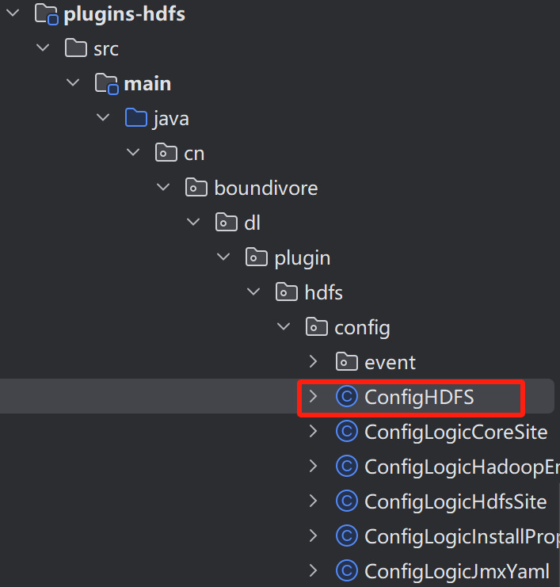

#### 4. 创建服务变动事件处理逻辑

在 event 包中，创建当前服务收到监听事件后，需要变动的处理逻辑。举个例子：

我现在已经部署好了 HDFS 服务，后来又新增部署了 Ranger，Ranger 部署之后，需要 HDFS 配合修改一些内容，从而让 Ranger 能够对 HDFS 的管理生效。在这个流程中，当 Ranger 部署时，会通知 HDFS ，Ranger 已经部署完毕，你可以开始修改相关内容了。

这个流程是全自动的，用户只需要在 **ConfigEventHandler.java** 类中进行声明即可，具体细节的逻辑，用户可以参考其他服务已经完成的代码。

**Tips：**很多数服务可以采取默认操作，即，不需要根据监听事件进行联动修改。另外，事件通知的触发包括以下几种情况：

* 当**服务 A** **强依赖(dependencies)** **服务 B** 时，当**服务 B** 发生变动，**服务 A** 也会收到相应的时间通知。
* 当**服务 A** **可选依赖(optional-dependencies)** **服务 B** 时，当**服务 B** 发生变动，**服务 A** 也会收到相应的时间通知。
* 当**服务 A** **涉及(relatives)** 服务 B 时，当**服务 A** 发生变动，**服务 B** 也会收到相应通知。

以上内容的具体通知逻辑，可以参考代码：**ConfigEvent.java**、**ConfigEventPublisher.java**、**ConfigEventSubscriber.java**

#### 5. 打包配置文件修改插件

以上内容完成后，便可以对插件进行打包了，因为插件内容代码量较少，且没有引用重量级第三方类库，所以，打包后，jar 包大小大约为 100K 以内。

打包方式如图所示：

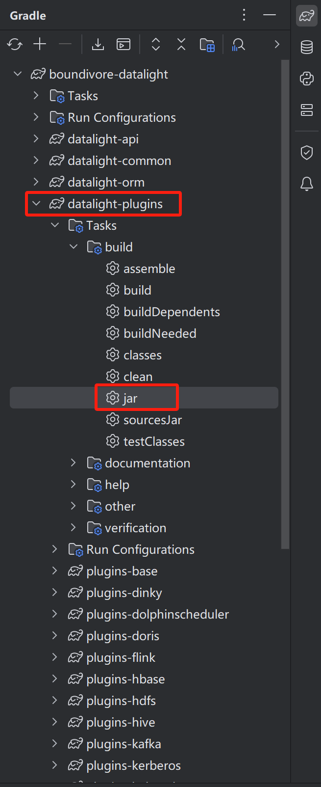

或在指定目录下通过 gradle 运行命令行工具即可。最终会在 build 目录下，得到该服务插件的 jar 包，以 HDFS 为例：

~~~shell
..../datalight-plugins/plugins-hdfs/build/libs/plugins-hdfs-1.0.0.jar
~~~

**Tips：**最终该 Jar 包放置于主节点上（Master 所在节点） **....../datalight/plugins/HDFS/jars/** 目录下即可。

## 三、更新服务部署列表清单

以上内容准备就绪后，就可以开始配置服务清单了 **0-SERVICE-MANIFEST.yaml** ，在这个文件中声明你新建的可部署服务。

在该文件中，主要包含如下内容：

* **name：** 服务名称，纯大写；

* **type：**服务类型，分为 **STORAGE(存储)**、**COMPUTE(计算)**、**BASE(基础)** 三种类型；

  **Tips：** 当你创建存储计算分离的部署架构时，计算集群不允许部署存储服务，只能关联存储集群中的存储服务；

* **desc：** 服务描述；

* **priority：**部署（操作）优先级，在部署执行时，将会按照优先级进行部署，数字越小，部署优先级越高；

* **dependencies：**当前服务强依赖的服务列表；

* **optional-dependencies：**当前服务可选依赖的服务列表；

* **relatives：**当前服务将会影响的服务列表；

根据这些内容，进行具体配置，即可完成服务的列表声明。

## 四、更新服务部署配置

完成服务部署列表声明后，需要完成对应的服务部署配置，每个服务都会对应这样一个配置文件，文件的命名格式为：**<服务名.yaml>**

例如：

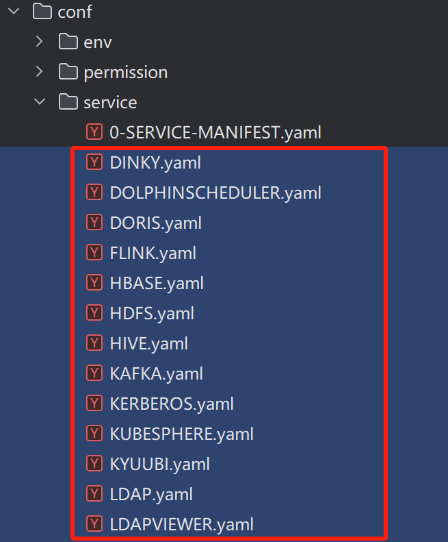

在服务部署配置文件中，需要声明具体的部署逻辑，服务下组件的启停逻辑，以及其他相关的可能的操作逻辑等，其中参数的具体注释，请参考开源项目中的**《开发手册》中的 3.2 小节：服务管理配置文件**

## 五、更新 UI 超链接配置

每个服务下可能包含多个组件，每个组件可能包含对应的管理页面，DataLight 希望用户可以快速跳转到服务自己的页面，因此，在 UI 中，增加了这个功能：

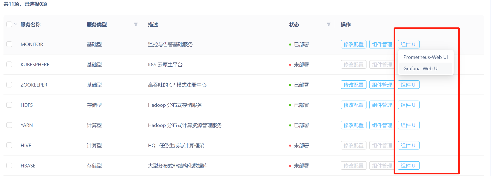

为了让你自己集成的服务也支持这一点，你需要对其进行配置和声明。

###  5.1 更新组件 UI 链接配置——COMPONENT-WEB-UI.yaml

在 **COMPONENT-WEB-UI.yaml** 文件中，你需要按照如下命名规则和格式来声明某个服务下的组件 UI 的访问信息：

~~~yaml
- service: MONITOR # 服务名称，全大写
  component: Prometheus # 服务下的组件名称，区分大小写
  port: '9090' # 组件 UI 页面的端口号
  path: '/graph' # 组件 UI 页面的访问路径
  button-name-suffix: '-Web UI' # 组件 UI 显示后缀
~~~

## 六、更新监控相关内容

当自定义的服务集成时，如果需要集成监控信息，则需要修改几处内容：

* plugins/MONITOR/dashboard/ 目录下需要新增关于该服务下组件的监控仪表，具体格式可以参考已有服务的内容；

* plugins/MONITOR/templated/prometheus/conf/prometheus.yml 中，需要新增该服务下组件的监控数据拉取地址；

* plugins/MONITOR/templated/prometheus/rules/ 目录下，需要新增该服务下组件的告警规则（如果需要的话）；

  **Tips：** 这里是默认的告警规则模板定义的地方，如果不需要默认的规则，也可以在部署部署完成后，在 DataLight 页面中，进行自定义告警规则的配置。

## 七、覆盖更新变动的文件与目录

以上所有内容准备完成后，就可以进行增量更新了。DataLight 允许在已经部署或正在生产的集群中，完成增量升级，要请务必了解整个代码流程与机制，防止发生不可预料的问题。

### 7.1 更新变动的目录与指定文件覆盖至 Master 节点

将上述所有变动的内容，按照指定的目录规则，依次覆盖更新到主节点（Master所在节点）即可。建议在覆盖更新这些内容时，先停止所有节点上的 Master 和 Worker 进程（建议这里通过脚本批量执行）。

### 7.2 分发所有变动的目录或文件到所有节点

如果集群是已经部署，则需要手动通过 scp 或 async 等工具推送到各个节点（这里也建议通过脚本批量自动执行），如果是准备部署的新集群，则无需手动执行推送，因为 DataLight Master 会自动执行全量的推送到各个节点。

推送完成后，启动 Master 进程即可。

**Tips：** Worker 进程会在必要时由 Master 进程启动后，自动拉起，因此无需手动管理 Worker 进程。

## 结语

希望通过该文档，能够帮助用户快速集成自己所需的服务。

**Tips：** DataLight 采用 **Apache 2.0 开源协议**，因此部分第三方服务因 **协议传染** 或 **协议继承** 问题， DataLight 官方无法直接提供集成，但用户可以自行集成，从而合法合规，避免协议问题。

## 参与开源

如果您对本项目感兴趣，欢迎提供积极的反馈，帮助该项目做的更好。

微信公众号：

QQ 交流群：

微信交流：

## 开源协议

本项目采用 Apache 2.0 开源协议。有关详细内容，请查看 [Apache 2.0 LICENSE](http://www.apache.org/licenses/)。