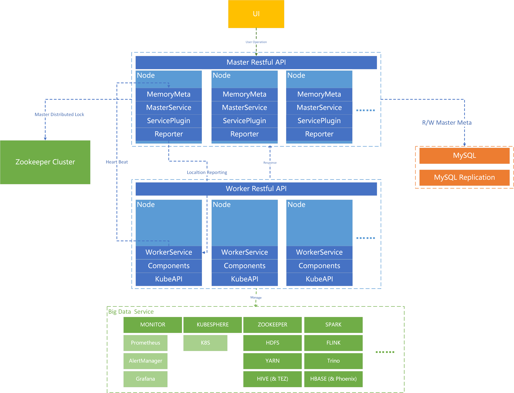

[[ENGLISH]](./.documents/docs/README(EN).md)

# Boundivore-DataLight

## 一、简介

DataLight 是一个开源的大数据运维管理平台，用于简化和自动化大数据服务的部署、管理和监控。它提供了一套全面的工具来管理您的大数据生态系统，旨在帮助企业实现简洁、快速地构建 OLAP 与 OLTP 统一的业务平台。用户可以通过 plugin 插件，以插拔式的方式快速集成自己的业务服务或其他大数据组件，从而在平台中进行统一管理。

资源汇总如下：

* [项目官网](http://datalight.boundivore.cn) 

* [后端 Gitee 主仓库](https://gitee.com/boundivore/boundivore-datalight) 
* [后端 Github 镜像仓库](https://github.com/Boundivore/boundivore-datalight) 
* [前端 Gitee 主仓库](https://gitee.com/boundivore/boundivore-datalight-web) 
* [前端 Github 镜像仓库](https://github.com/Boundivore/boundivore-datalight-web) 
* [产品手册](./.documents/docs/产品手册.md)
* [开发手册](./.documents/docs/开发手册.md)

* [开发规划](./.documents/docs/开发规划.md)

* [资源包下载地址](https://pan.baidu.com/s/1342bIcEBDQHdFA35KUTjbQ) `网盘提取码: data`

* [视频教程](https://space.bilibili.com/3546708503955571/channel/seriesdetail?sid=4187881&ctype=0)

* [支持与服务政策](./.documents/docs/开源 DataLight 大数平台支持与服务政策.md)

## 二、软件架构

这个软件架构通过Master-Worker主从模式实现了高可用、可扩展的分布式计算与大数据处理平台。

* UI 层：用户通过 UI 层进行操作和管理。UI 层与 Master Restful API 进行交互，发送用户操作请求；
* Master 层：Master 层是整个系统的核心，负责管理和协调 Worker 层的操作。它包含多个节点，每个节点负责不同的功能模块；
* MemoryMeta：内存元数据缓存层；
* MasterService：主服务业务逻辑管理；
* ServicePlugin：服务插件管理；
* Reporter：Master/Worker 双向交互服务；
* Master 层：通过 Restful API 接收 UI 层的请求，并协调 Worker 层的操作。未来，如有必要，Master 层与 Zookeeper 集群保持心跳连接，以确保分布式锁的管理和 Master 的故障切换。Master 层还通过 MySQL 数据库进行元数据的读写操作。
* WorkerService ：从节点业务逻辑管理；
* Components：各类集成在平台中的组件；
* KubeAPI：与 Kubernetes/KubeSphere API 交互的服务管理；

## 三、概念与定义

* 服务：HDFS、YARN、HIVE 等称之为服务，其名称在本项目中的标准命名为全大写，且服务名称全局唯一。
* 组件：HDFS 中的独立进程，例如：NameNode、DataNode 等称之为组件，在本项目中的标准命名方式为帕斯卡命名法，且组件名称全局唯一。
* 主进程：DataLight Master 进程称之为主进程，其所在节点称之为平台主节点。
* 从进程：DataLight Worker 进程称之为从进程，其所在节点称之为平台从节点。

## 四、主要功能

下表列出了 DataLight 平台当前一级功能及其受支持状态：

| 序号 | 一级功能               | 是否已支持 |
| ---- | ------------------- | -------- |
| 1    | 节点初始化助手          | 是       |
| 2    | 主从进程维护            | 是       |
| 3    | 集群管理               | 是       |
| 4    | 节点初始化             | 是       |
| 5    | 节点操作与管理            | 是       |
| 6    | 服务组件装配信息管理 | 是       |
| 7 | 服务操作与管理 | 是 |
| 8 | 组件操作与管理 | 是 |
| 9  | 服务组件预配置项管理 | 是       |
| 10 | 服务组件配置文件管理 | 是 |
| 11 | 分布式日志全局管理   | 是       |
| 12 | 监控管理               | 是       |
| 13 | 告警管理               | 是       |
| 14 | 用户管理               | 是       |
| 15 | 权限管理               | 是       |

## 五、编译环境

本项目编译需要满足如下需要：

* JDK 8
* Gradle 7.4+

## 六、部署说明

部署本项目前，请确保你已经准备好了必要的物理资源、操作系统并且理解了本项目的部署流程。

### 6.1 准备物理资源

确保您有足够的硬件资源来部署和运行本项目。推荐的最小配置包括：

- CPU：4 Cores +
- 内存：8 GB +
- 硬盘：100 GB +
- 网络：1 Gbps +
- 节点数：>= 3

### 6.2 准备操作系统

本项目目前仅支持（其他系统未测试）：

- CentOS 7.x (推荐：CentOS-7-x86_64-DVD-2009.iso)

### 6.3 准备部署资源

clone 本项目，并下载所以来的服务组件包和依赖库库，包括：

* clone 当前仓库，并编译；

* 下载服务组件包，并放置于 plugins 目录下；

* 构建 Linux 本地目录如下，并包含各目录中对应的文件（可直接网盘下载，或从项目的 .document 目录中拷贝）：

  | 目录                                              | 说明                                      | 是否必要 |
  | ------------------------------------------------- | ----------------------------------------- | -------- |
  | /opt/datalight/app                                | 主从进程包目录                            | 是       |
  | /opt/datalight/app/config                         | 主从进程包启动配置目录                    | 是       |
  |                                                   |                                           |          |
  | /opt/datalight/assistant                          | 初始化节点助手目录                        | 是       |
  | /opt/datalight/assistant/conf                     | 初始化节点助手配置文件                    | 是       |
  | /opt/datalight/assistant/main                     | 初始化节点助手执行总入口                  | 是       |
  | /opt/datalight/assistant/repo                     | 初始化节点助手依赖资源                    | 是       |
  | /opt/datalight/assistant/scripts                  | 初始化节点助手相关子脚本                  | 是       |
  |                                                   |                                           |          |
  | /opt/datalight/bin                                | 主从进程启停管理脚本                      | 是       |
  |                                                   |                                           |          |
  | /opt/datalight/conf                               | 环境与服务配置文件目录                    | 是       |
  | /opt/datalight/conf/env                           | 环境配置文件与脚本目录                    | 是       |
  | /opt/datalight/conf/service                       | 服务部署维护配置文件目录                  | 是       |
  | /opt/datalight/conf/permission                    | 权限生命与备注文件（暂无用）              | 否       |
  | /opt/datalight/conf/web                           | 服务组件 WebUI 配置文件目录               | 是       |
  |                                                   |                                           |          |
  | /opt/datalight/docs                               | 项目文档目录                              | 否       |
  | /opt/datalight/docs/api                           | 三方 API 目录                             | 否       |
  | /opt/datalight/docs/asserts                       | 文档资源目录                              | 否       |
  | /opt/datalight/docs/package                       | 服务组件打包步骤文档记录目录              | 否       |
  | /opt/datalight/docs/maven                         | Maven 配置目录                            | 否       |
  | /opt/datalight/docs/src-[大写服务名称]-版本号     | 服务组件源码文件修改记录目录              | 否       |
  |                                                   |                                           |          |
  | /opt/datalight/exporter                           | JMX Eeporter 目录                         | 是       |
  | /opt/datalight/exporter/bin                       | Exporter 运行脚本示例目录                 | 否       |
  | /opt/datalight/exporter/conf                      | Exporter 配置文件模板目录                 | 是       |
  | /opt/datalight/exporter/jar                       | Exporter 插件 Jar 包所在目录              | 是       |
  |                                                   |                                           |          |
  | /opt/datalight/node                               | 节点操作相关配置与脚本目录                | 是       |
  | /opt/datalight/node/conf                          | 节点操作相关配置文件目录                  | 是       |
  | /opt/datalight/node/scripts                       | 节点操作相关操作的脚本文件所在目录        | 是       |
  |                                                   |                                           |          |
  | /opt/datalight/orm                                | 数据库相关资料目录                        | 否       |
  | /opt/datalight/orm/dmj                            | 数据库模型设计目录                        | 否       |
  | /opt/datalight/orm/query                          | 项目中可能用到的 SQL 查询示例目录         | 否       |
  | /opt/datalight/orm/sql                            | Master 元数据库 Schema 初始化文件所在目录 | 否       |
  |                                                   |                                           |          |
  | /opt/datalight/plugins                            | 服务组件对应的插件目录                    | 是       |
  | /opt/datalight/plugins/[大写服务名称]/dashboard   | 仅 MONITOR 中存在，各个服务组件的监控模板 | 是       |
  | /opt/datalight/plugins/[大写服务名称]/dlc         | 服务组件资源包（.tar.gz)                  | 是       |
  | /opt/datalight/plugins/[大写服务名称]/jars        | 服务组件对应的插件编译后的 Jar 包所在目录 | 是       |
  | /opt/datalight/plugins/[大写服务名称]/placeholder | 服务组件预配置项配置文件所在目录          | 是       |
  | /opt/datalight/plugins/[大写服务名称]/scripts     | 服务组件聚合操作脚本所在目录              | 是       |
  | /opt/datalight/plugins/[大写服务名称]/templated   | 服务组件配置文件模板所在目录              | 是       |
  |                                                   |                                           |          |
  | /opt/datalight/scripts                            | 公共脚本目录                              | 是       |
  | /opt/datalight/scripts/tools                      | 通用工具脚本目录                          | 是       |

#### 6.3.1  创建对应目录

在开始前，首先确认已在主节点中存在上述对应目录。

#### 6.3.2  准备前端页面

前往 DataLight 前端开源项目，按照对应文档执行编译操作，编译后，将编译文件解压后，拷贝至后端源码项目 boundivore-datalight\datalight-services\services-master\src\main\resources\public 目录中。

DataLight 前端开源项目：

~~~http
https://gitee.com/boundivore/boundivore-datalight-web
~~~

#### 6.3.3 准备 Master/Worker

将项目克隆后，使用代码编辑器打开后，执行 datalight-services 模块的编译操作（执行 boot-jar， 或从网盘中下载编译好的 jar 包)，在 services-master 与 services-worker 项目的 build/libs 目录下，可以分别看到 services-master-[版本号].jar、services-worker-[版本号].jar 两个进程文件，拷贝至 app/ 目录下即可。

#### 6.3.4 准备服务组件插件 Plugins

将项目克隆后，使用代码编辑器打开后，执行 datalight-plugins 模块的编译操作，将该模块下对应服务的插件 jar 包拷贝至指定目录(plugins/[服务名称]/jar)中，例如：/opt/datalight/plugins/[大写服务名称]/jars。

#### 6.3.5 拷贝其他文件目录

在主项目目录中，找到 .documents 文件夹，其下对应内容，拷贝至上述表格中对应的目录中即可。

#### 6.3.6 准备 DLC 服务包

前往如下地址下载 DLC 服务包：

~~~http
链接：https://pan.baidu.com/s/1342bIcEBDQHdFA35KUTjbQ 
提取码：data 
~~~

下载后，解压，将对应服务的 .tar.gz 包放置于对应的 /opt/datalight/plugins/[大写服务名称]/dlc 的目录中即可。

### 6.4 初始化环境

在启动 Master 主程序之前，需要确认各个准备服役的节点已经完成相关初始化操作，DataLight 平台封装了相关工具，可帮助用户快速一次性初始化所有节点，用户也可手动进行初始化操作。

#### 6.4.1 自动初始化

自动初始化过程中，依赖 expect 工具，脚本中会自动安装该工具，即自动执行：
~~~shell
yum -y install expect
~~~

如需自主安装该工具，可修改脚本 `init-main.sh`。

---

自动初始化工具位于部署目录下的 assistant 目录，其中涉及到修改的内容如下。

注意：MySQL 5.7 请自行手动安装，自动初始化工具将不包含这部分内容。

下面将对个配置文件进行举例说明。

* init-main-cluster.properties

  ~~~properties
  # 准备初始化的节点列表配置信息，Key 前缀为序号，不可重复，需要初始化多少节点，则添加多少节点
  # 建议：1.node.ip 为当前执行脚本的节点 IP
  1.node.ip=192.168.137.10
  1.node.ssh.port=22
  1.node.hostname=node01
  1.node.user.root=root
  1.node.pwd.root=123456
  1.node.user.datalight=datalight
  1.node.pwd.datalight=12345678
  
  2.node.ip=192.168.137.11
  2.node.ssh.port=22
  2.node.hostname=node02
  2.node.user.root=root
  2.node.pwd.root=123456
  2.node.user.datalight=datalight
  2.node.pwd.datalight=12345678
  
  3.node.ip=192.168.137.12
  3.node.ssh.port=22
  3.node.hostname=node03
  3.node.user.root=root
  3.node.pwd.root=123456
  3.node.user.datalight=datalight
  3.node.pwd.datalight=12345678
  ~~~

* init-main-single-settings.txt

  脚本将按照下面的内容依次在 “每个节点” 按脚本 “配置顺序” 执行，从而完成对各个节点的初始化操作。

  ~~~text
  init-stop-firewall.sh
  init-ssh-remove-ask.sh
  init-close-swap.sh
  init-optimize-sysctl.sh
  init-systemd-conf.sh
  init-hostname.sh
  init-hosts.sh
  init-user-group.sh
  init-datalight-env.sh
  init-jdk.sh
  init-yum-install.sh
  init-chrony-server-config.sh
  init-chrony-client-config.sh
  ~~~

#### 6.4.2 手动初始化

如果使用上述自动初始化操作，则无需再进行手动初始化操作。以下操作用于不想使用自动初始化工具的用户。

手动初始化涉及如下内容：

* 关闭防火墙（或开放服务所需访问限制）

* 关闭 SSH 访问确认

* 关闭 Swap 内存交换

* 优化内存管理和I/O性能

* 设置一个进程可以拥有的最大内存映射区域数量为 655300

  ~~~shell
  vm.max_map_count=655300  # 设置一个进程可以拥有的最大内存映射区域数量为 655300。
  vm.dirty_ratio=10  # 指定系统中“脏”页占可用内存的最大百分比为 10%。
  vm.dirty_background_ratio=5  # 指定后台写脏页操作开始的内存占用百分比阈值为 5%。
  vm.dirty_writeback_centisecs=200  # 设置内核周期性地将脏页写回磁盘的时间间隔为 200 百分之一秒（即每 2 秒）。
  vm.vfs_cache_pressure=200  # 控制内核回收目录和 inode 缓存时的积极程度为 200。
  vm.dirty_expire_centisecs=6000  # 设置脏页在被强制写回磁盘前可以在内存中停留的最长时间为 6000 百分之一秒（即 60 秒）。
  ~~~

* 优化内存管理、I/O性能和资源限制，以提高系统在处理大量数据和内存映射任务时的效率和稳定性

  ~~~shell
  vm.max_map_count=655300  # 设置一个进程可以拥有的最大内存映射区域数量为 655300。
  vm.dirty_ratio=10  # 指定系统中“脏”页占可用内存的最大百分比为 10%。
  vm.dirty_background_ratio=5  # 指定后台写脏页操作开始的内存占用百分比阈值为 5%。
  vm.dirty_writeback_centisecs=200  # 设置内核周期性地将脏页写回磁盘的时间间隔为 200 百分之一秒（即每 2 秒）。
  vm.vfs_cache_pressure=200  # 控制内核回收目录和 inode 缓存时的积极程度为 200。
  vm.dirty_expire_centisecs=6000  # 设置脏页在被强制写回磁盘前可以在内存中停留的最长时间为 6000 百分之一秒（即 60 秒）。
  
  sed -i '/^DefaultLimitNOFILE=/d' "$system_conf"  # 删除 system.conf 中现有的 DefaultLimitNOFILE 设置
  sed -i '/^DefaultLimitNPROC=/d' "$system_conf"  # 删除 system.conf 中现有的 DefaultLimitNPROC 设置
  echo "DefaultLimitNOFILE=131072" >> "$system_conf"  # 添加新的 DefaultLimitNOFILE 设置
  echo "DefaultLimitNPROC=131072" >> "$system_conf"  # 添加新的 DefaultLimitNPROC 设置
  
  cat > "/etc/security/limits.conf" << EOF
  root        soft    nproc   131072  # 设置 root 用户的软 nproc 限制为 131072
  root        hard    nproc   131072  # 设置 root 用户的硬 nproc 限制为 131072
  root        soft    nofile  131072  # 设置 root 用户的软 nofile 限制为 131072
  root        hard    nofile  131072  # 设置 root 用户的硬 nofile 限制为 131072
  *           soft    nproc   131072  # 设置所有用户的软 nproc 限制为 131072
  *           hard    nproc   131072  # 设置所有用户的硬 nproc 限制为 131072
  *           soft    nofile  131072  # 设置所有用户的软 nofile 限制为 131072
  *           hard    nofile  131072  # 设置所有用户的硬 nofile 限制为 131072
  *           hard    fsize   unlimited  # 设置所有用户的硬文件大小限制为无限
  *           soft    fsize   unlimited  # 设置所有用户的软文件大小限制为无限
  *           soft    cpu     unlimited  # 设置所有用户的软 CPU 时间限制为无限
  *           hard    cpu     unlimited  # 设置所有用户的硬 CPU 时间限制为无限
  *           soft    as      unlimited  # 设置所有用户的软地址空间限制为无限
  *           hard    as      unlimited  # 设置所有用户的硬地址空间限制为无限
  EOF
  ~~~

  * 修改所有节点主机名

  * 修改所有节点内网 IP 与主机名映射关系

  * 创建 Linux 中 DataLight 用户名与组

  * 设置系统、用户、伪终端环境变量

  * 安装 JDK 1.8

  * 安装 yum 依赖

    ~~~shell
    yum -y install epel-release  # 安装 EPEL 仓库，提供额外的软件包
    yum -y install jq  # 安装 jq，用于处理 JSON 数据
    yum -y install curl  # 安装 curl，用于命令行数据传输
    yum -y install chrony  # 安装 chrony，用于时间同步
    yum -y install expect  # 安装 expect，用于自动化交互式 shell 脚本
    yum -y install openssl openssl-devel patch  # 安装 OpenSSL 和开发包及 patch 工具
    yum -y install lrzsz  # 安装 lrzsz，用于 ZMODEM 文件传输
    yum -y install unzip zip  # 安装 unzip 和 zip，用于解压和压缩文件
    yum -y install yum-utils  # 安装 yum-utils，提供额外的 yum 命令
    yum -y install net-tools  # 安装 net-tools，提供网络工具如 ifconfig
    
    yum -y install gcc gcc-c++  # 安装 GCC 和 G++ 编译器
    yum -y install make  # 安装 make，构建自动化工具
    yum -y install autoconf automake libtool curl  # 安装 autoconf、automake、libtool 和 curl，用于构建和配置软件
    yum -y install zlib lzo-devel zlib-devel openssl openssl-devel ncurses-devel ruby  # 安装 zlib、lzo-devel、zlib-devel、openssl、openssl-devel、ncurses-devel 和 ruby，用于压缩、加密、终端控制和 Ruby 语言支持
    yum -y install snappy snappy-devel bzip2 bzip2-devel lzo lzo-devel lzop libXtst  # 安装 snappy、snappy-devel、bzip2、bzip2-devel、lzo、lzo-devel、lzop 和 libXtst，用于数据压缩和图形界面支持
    ~~~

  * 主节点安装并配置 chrony 时间管理服务器

  * 从节点安装并配置 chrony 时间同步客户端

  * 安装 MySQL 5.7（如需 MySQL 8+ 以上支持，可自行适配平台以及服务组件源码）

### 6.5 初始化 DataLight 数据库

上述环境初始化完毕后，需按照如下步骤初始化平台数据库；

* 创建 db_datalight 数据库

  ~~~sql
  CREATE DATABASE db_datalight DEFAULT CHARACTER SET utf8mb4 COLLATE utf8mb4_unicode_ci;
  ~~~

* 执行初始化 SQL 文件

  ~~~sql
  USE db_datalight;
  SOURCE /opt/datalight/orm/sql/db_datalight.sql;
  ~~~

### 6.6 启动 Master 主程序

完成上述初始化操作后，各个节点已经准备好了工作所需的内容，此时可以通过如下方式启动 Master 进程，在主节点中执行：

~~~shell
/opt/datalight/bin/datalight.sh start master 8001
~~~

启动成功后，将看到如下日志内容：

~~~shell
No masterIp provided or masterIp is empty. Skipping IP validation.
master starting in 10263...
master started.
/opt/datalight/bin/datalight.sh done.
~~~

### 6.7  登录

启动 Master 主进程成功后，可访问如下页面进行登录：

~~~http
http://<Master-IP>:8001
~~~

注：首次默认账号密码为：admin/admin

页面如下：

## 七、产品手册

完成上述内容后，请查看  [产品手册](./.documents/docs/产品手册.md)   继续页面部署操作。

## 八、计划支持的服务

| 服务              | 版本     | 是否已支持 | 完成日期    |
|-----------------|--------|------------|---------|
| ZOOKEEPER       | 3.8.2  | √          | 2023-07 |
| HDFS            | 3.2.4  | √          | 2023-07 |
| YARN            | 3.2.4  | √           | 2023-08 |
| PROMETHEUS      | 2.46.0 | √           | 2023-08 |
| ALERTMANAGER    | 0.26.0 | √           | 2023-08 |
| GRAFANA         | 10.0.3 | √           | 2023-08 |
| HIVE            | 3.1.3  | √           | 2024-04 |
| TEZ             | 0.10.2 | √ | 2024-04 |
| HBASE           | 2.5.9 | √           | 2024-04 |
| SPARK           | 3.1.3 | √           | 2024-05 |
| FLINK           | 1.19.0 | √ | 2024-05 |
| ZKUI            | 2.0.0 | √ | 2024-08 |
| KYUUBI          | 1.9.0 | √ | 2024-08 |
| HUDI            | 待定 |            |         |
| KUBESPHERE      | 3.3.2  | √           | 2023-09 |
| SEATUNNEL       | 待定 |            |         |
| DOPHINSCHEDULER | 3.1.9 | √ | 2024-10 |
| KERBEROS        | 1.15.1 | √ | 2024-08 |
| LDAP            | 2.4.44 | √ | 2024-08 |
| SSSD            | 1.16.5 | √ | 2024-08 |
| RANGER          | 2.4.0 | √ | 2024-09 |
| ATLAS           | 待定 |            |         |
| HUE             | 待定 |            |         |
| KAFKA           | 2.6.0 | √ | 2024-05 |
| ES              | 任意 | 因协议问题，用户自行集成即可 |         |
| TRINO           | 待定 |            |         |
| KYLIN           | 待定 |            |         |
| KUDU            | 待定 |            |         |
| IMPALA          | 待定 |            |         |
| MINIO           | 20241218 | √ | 2024-12  |
| More....        |  | |         |

## 参与开源

如果您对本项目感兴趣，欢迎提供积极的反馈，帮助该项目做的更好。

微信公众号：

QQ 交流群：

微信交流：

## 开源协议

本项目采用 Apache 2.0 开源协议。有关详细内容，请查看 [Apache 2.0 LICENSE](http://www.apache.org/licenses/)。

## 鸣谢

### 用户

感谢所有贡献者和提交者

#### 贡献者（Contributors）

特别感谢以下人员对本项目的贡献：

- [@boundivore](https://gitee.com/boundivore)
- [@Tracy-88](https://gitee.com/Tracy-88)

#### 提交者（Committers）

特别感谢以下人员为本项目提交代码：

- [@boundivore](https://gitee.com/boundivore)
- [@Tracy-88](https://gitee.com/Tracy-88)

我们非常感谢他们的支持和贡献！

### 项目

在此特别感谢所有在本项目研发过程中使用到的开源项目或代码库。

没有这些项目的支持，本项目无法顺利进行。

其中特别鸣谢以下开源项目： 
- **[Spring](https://spring.io/)**：一个轻量级的应用框架和控制反转容器。
- **[Hutool](https://hutool.cn/)**：一个小而全的 Java 工具类库。
- **[Sa-Token](https://sa-token.dev33.cn/)**：一个轻量级的 Java 权限认证框架。
- **[SshJ](https://github.com/hierynomus/sshj)**：一个用于 Java 的 SSH 库。

## 推荐

在此，我们推荐一些其他优秀的开源项目，希望对你有帮助：

- **[Hutool](https://hutool.cn/)**：Hutool 是一个小而全的 Java 工具类库，通过简化代码和提供丰富的工具类，帮助开发者提高开发效率。它的功能涵盖了字符串操作、日期处理、文件操作、HTTP 请求等多个方面，是 Java 开发者的得力助手。
- **[Sa-Token](https://sa-token.dev33.cn/)**：Sa-Token 是一个轻量级的 Java 权限认证框架，提供了简单易用的登录认证、权限验证、Session 会话管理等功能。它支持多种登录方式和权限控制策略，适用于各种 Java Web 应用。
- **[Mybatis-Plus](https://baomidou.com/)**：MyBatis-Plus 是 MyBatis 的最佳搭档，是一个强大的 ORM 框架增强工具，秉承"只做增强不做改变"的理念。它提供了高效的单表 CRUD 操作、代码生成、自动分页、逻辑删除、自动填充等丰富功能，大幅简化开发流程并提升效率。

希望这些推荐的项目能够帮助你在开发过程中提高效率，解决常见问题。

